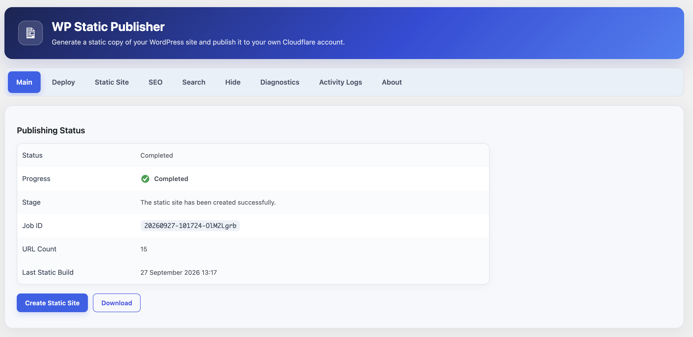
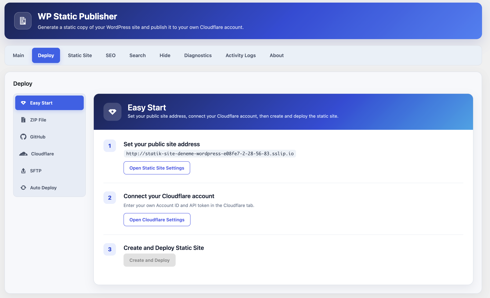
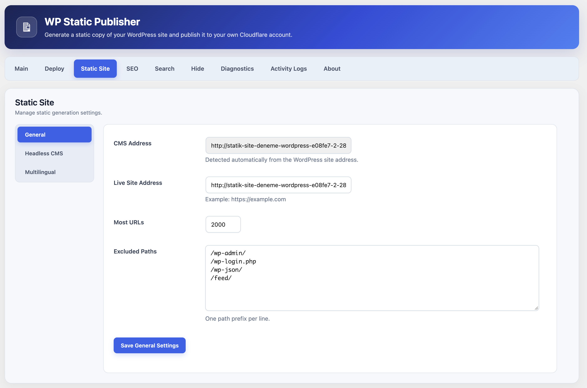
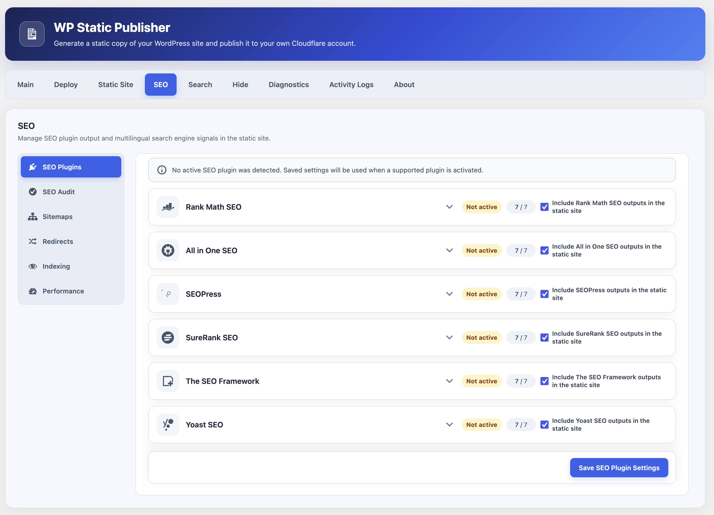
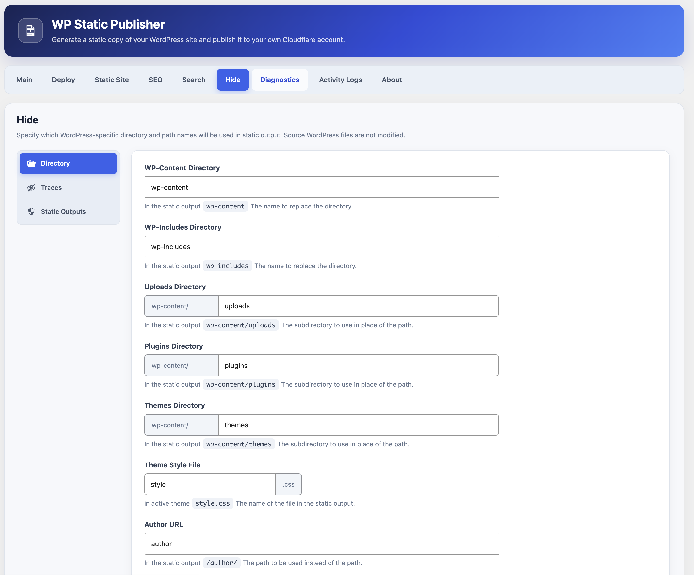

# WP Static Publisher

An open-source WordPress plugin that exports sites as static files and deploys them to your own Cloudflare Workers account. Headless CMS mode keeps the WordPress theme front end private while preserving its design in the static export.

## Screenshots

1. **Main dashboard** — publishing status and the latest static build.

   

2. **Deploy** — guided setup for your own Cloudflare account.

   

3. **Static Site** — general settings and access to Headless CMS and multilingual options.

   

4. **SEO** — integrations and static search engine settings.

   

5. **Hide** — static output paths and WordPress trace settings.

   

## Features

- Crawl same-origin HTML, CSS, JavaScript, images, and fonts; replace WordPress origin URLs with the public static domain.
- Convert asset URLs to root-relative paths that work on both `workers.dev` and custom domains.
- Generate Cloudflare `_headers` and `_redirects`, a ZIP archive, and a SHA-256 manifest.
- Manage exports from the WP Static Publisher admin screen, with Main, Deploy, Static Site, SEO, Search, Hide, Diagnostics, Activity Logs, and About tabs.
- Configure General, Headless CMS, and Multilingual settings under Static Site.
- Control metadata by content type, Schema, XML sitemaps, and `robots.txt` for Rank Math, All in One SEO, SEOPress, SureRank SEO, The SEO Framework, and Yoast SEO. The SEO Plugins screen summarizes the active integration and its output.
- Use English interface strings by default. Turkish, Spanish, French, Simplified Chinese, Japanese, Arabic, and Portuguese translations follow the WordPress administrator's selected locale.
- Deploy through ZIP download, GitHub Actions, your own Cloudflare account, or SFTP. Optional automatic deployment is available.
- Connect your own Cloudflare Account ID and API token for direct Workers Static Assets deployment. The token is encrypted using WordPress security keys and can be removed from the plugin.
- Start an export and Cloudflare deployment with one action; track export and deployment results separately. GitHub Actions callbacks are checked against the job ID and SHA-256 manifest.
- Browse, download, and delete ZIP archives from **Deploy > ZIP File**, with ten archives per page and a configurable retention limit (five by default). The archive table shows job ID, URL count, creation time, and display order. You can delete archives individually or in bulk while retaining the latest ZIP.
- Store SFTP passwords encrypted; test the connection, upload manually, or upload automatically after a successful export.
- Build configurable static search with a bundled Fuse.js 7.3.0 and separate Static Search, Indexing Selectors, and Fuse.js settings.
- Produce JSON/HTML SEO audit reports covering canonical and hreflang tags, images, and Schema.
- Generate sitemaps with canonical URLs, last-modified dates, images, and language alternatives; optional video and Google News sitemaps are available.
- Export old WordPress slugs, Redirection and Rank Math rules, and custom redirects to `_redirects`.
- Configure path-based noindex rules, file `X-Robots-Tag` headers, IndexNow for changed URLs, and a performance report.
- Rename WordPress paths and remove version, generator, XML-RPC, embed, and emoji traces from static output through Hide settings.
- Close the WordPress theme front end to visitors in Headless + Static Publisher mode while signed internal export requests retain the homepage and theme design.
- Show the latest successful build and a green progress/completion indicator on Main. Live export status refreshes every two seconds, shows each stage, and warns about stalled WP-Cron jobs.
- Search Activity Logs with centered pagination and WordPress date/time formatting. Logs are kept outside the database for the latest export, show 50 entries per page, and list source WordPress URLs and generated static paths in separate columns.
- Check PHP, Basic Auth, php-xml, cURL, site URL access, permalinks, indexability, caching, WP-Cron, conflicting plugins, temporary directories, and MySQL permissions.
- Run `wp wp-static-publisher export` with WP-CLI; the previous `wp wext-static export` command remains available for existing installations.
- Expose Application Password-protected export, status, artifact, and deployment callback REST endpoints. CI can use the limited `Static Publisher Deploy` role.
- Select automatic export triggers for posts, pages, custom content, taxonomies, media, menus, widgets, themes, and site settings. Changes are grouped into a 60-second window; an optional deployment webhook follows a successful export.
- Export directory-based languages such as `/en/` and `/tr/` together, with language selection at the root URL.
- Use the included GitHub Actions example for Cloudflare Workers Static Assets.

## Installation

Copy the `wext-static-publisher` directory to WordPress `wp-content/plugins/` and activate the plugin. Open **WP Static Publisher** in the main admin menu to set the public domain and URL limit.

The installable ZIP is named `wp-static-publisher.zip`. Its internal directory, text domain, `wext_*` options, and REST identifiers remain `wext-static-publisher` for compatibility with existing installations. You can update the plugin without uninstalling it.

PHP DOM and Zip extensions are required. The SFTP client is bundled, so PHP cURL/libcurl does not need SFTP support. For long exports and SFTP jobs, run `wp-cron.php` with a system cron job.

## WP-CLI

```bash
wp wp-static-publisher export
wp wp-static-publisher export --format=json
```

## GitHub Actions and CI secrets

- `WP_ORIGIN`: WordPress origin, for example `https://cms.example.com`.
- `WP_USER`: automation user with the `Static Publisher Deploy` role.
- `WP_APP_PASSWORD`: that user's WordPress Application Password.
- `CLOUDFLARE_API_TOKEN`: a Cloudflare API token with only the permissions needed for your Worker deployment target.
- `CLOUDFLARE_ACCOUNT_ID`: your Cloudflare Account ID.

The example workflow is in `.github/workflows/deploy-example.yml`. In the GitHub deployment path, configure the Worker name and asset settings in `wrangler.jsonc`; manage the custom domain in the Cloudflare dashboard. Give the CI user the plugin's `Static Publisher Deploy` role and a separate Application Password.

For automated deployments, set the deployment webhook in plugin settings to `https://api.github.com/repos/OWNER/REPO/dispatches`. Create a fine-grained bearer token with `Contents: write` access only to that repository. Keep the workflow on the repository's default branch. This path stores the Cloudflare token only in GitHub secrets; direct deployment encrypts it in WordPress.

With a webhook configured, the Main screen labels **Create Static Site** as **Deploy to Cloudflare**. The action builds a static snapshot. After a successful export, GitHub Actions downloads only `/exports/{job_id}/artifact`, checks the job ID and SHA-256 in its manifest, deploys it with Wrangler, and checks the live URL. It reports the result through `/deployments/callback`; the Main and **Deploy > Cloudflare** screens show export and deployment states separately.

The callback and job-specific artifact endpoints also require the `Static Publisher Deploy` role and Application Password authentication. Use this limited role for `WP_USER`.

## Deploy directly to your own Cloudflare account

The plugin is free and its original code is licensed under MIT. SEO, automatic exports, GitHub deployment, and Cloudflare deployment require no license key. Set the public HTTPS URL under **Static Site > General**. Under **Deploy > Cloudflare**, enter your [Cloudflare Account ID](https://developers.cloudflare.com/fundamentals/account/find-account-and-zone-ids/), a unique Worker name, and an [API token](https://developers.cloudflare.com/fundamentals/api/get-started/create-token/) with `Workers Scripts Write` permission for your account. You can use a user or account API token. The plugin encrypts it with a key derived from WordPress security keys and never displays it again. Disconnecting removes the stored token from WordPress; revoke the token in Cloudflare if needed.

**Deploy to Cloudflare** creates a fresh static ZIP and build directory, then sends the asset manifest, missing files, and Worker module directly to your account through Cloudflare's [Direct Upload API](https://developers.cloudflare.com/workers/static-assets/direct-upload/). The `_headers` and `_redirects` rules are included in the Worker asset configuration. No external deployment service, OAuth app, or license server is involved.

Configure a `workers.dev` subdomain or custom domain for the Worker in your Cloudflare dashboard. The target URL under **Static Site > General** must match that domain. The plugin does not create custom domains or change DNS records. An old service connection is not migrated automatically; connect once with your own token.

GitHub Actions, ZIP download, and SFTP remain available. Keep the Cloudflare token in GitHub secrets for the GitHub workflow. Direct deployment does not require GitHub.

## SFTP deployment

Under **Deploy > SFTP**, save the host, port, username, password, and remote directory. The password is encrypted with Sodium or OpenSSL using a key derived from WordPress security keys and is never displayed again. Use **Test Connection**, then **Upload Latest Static Site**. You can also enable automatic SFTP upload after each successful export.

For server identity verification, enter the 32-character MD5 SSH host fingerprint provided by your hosting provider. Uploads overwrite matching remote paths but do not delete unrelated or outdated files. An SFTP failure does not remove a successfully exported ZIP, and SFTP status is tracked separately.

## Multilingual routing

Your WordPress multilingual plugin must publish translations at directory-based URLs such as `/en/`, `/tr/`, and `/de/`. Enter the same codes, one per line, under **Static Site > Multilingual**, select the default language, and enable routing.

New installations default to English, with `en` first in **Supported Language Codes**. The WordPress site language and Turkish are also included in the initial list. Previously saved language settings remain unchanged after an update.

The exporter crawls each language root and fails the export if one is missing. The Cloudflare Worker reads `wext-language-config.json` from the static package. Only requests to `/` are routed: the Worker checks the `wext_language` cookie, then `Accept-Language`, then the configured default language. Explicit language URLs such as `/en/about/` are never redirected. Visiting a language directory updates the preference cookie.

Each translated page should have the correct `lang`, canonical, and reciprocal `hreflang` tags in WordPress. The exporter maps `hreflang` URLs to the public static domain and adds `x-default` for the root router if needed. Query-string languages such as `?lang=en` are not supported.

## SEO plugin integrations

Enable each integration under **SEO > SEO Plugins**. Rank Math, All in One SEO, SEOPress, SureRank SEO, The SEO Framework, and Yoast SEO have separate controls for page, post, custom post type, and archive/taxonomy metadata. JSON-LD Schema, XML sitemaps, and `robots.txt` can be selected independently. The exporter maps internal URLs to the public static domain and updates `SearchAction` for static search when enabled.

For SureRank and Yoast SEO, sitemap crawling starts at `/sitemap_index.xml`; for The SEO Framework, it starts at `/sitemap.xml`; SEOPress uses `/sitemaps.xml`. Only same-origin XML/XSL files are packaged.

## Development checks

```bash
find wext-static-publisher -name '*.php' -print0 | xargs -0 -n1 php -l
bash -n scripts/*.sh
node --test tests/worker-language-routing.mjs
npx --yes wrangler@latest deploy --dry-run
./scripts/package-plugin.sh
npx --yes @wp-playground/cli@latest php --php=8.1 --wp=latest --auto-mount=wext-static-publisher --mount=.:/workspace -- /workspace/tests/playground-smoke.php
npx --yes @wp-playground/cli@latest php --php=8.1 --wp=latest --auto-mount=wext-static-publisher --mount=.:/workspace -- /workspace/tests/playground-brand-migration.php
npx --yes @wp-playground/cli@latest php --php=8.1 --wp=latest --auto-mount=wext-static-publisher --mount=.:/workspace -- /workspace/tests/playground-activity-log.php
npx --yes @wp-playground/cli@latest php --php=8.1 --wp=latest --auto-mount=wext-static-publisher --mount=.:/workspace -- /workspace/tests/playground-archives.php
npx --yes @wp-playground/cli@latest php --php=8.1 --wp=latest --auto-mount=wext-static-publisher --mount=.:/workspace -- /workspace/tests/playground-export.php
npx --yes @wp-playground/cli@latest php --php=8.1 --wp=latest --auto-mount=wext-static-publisher --mount=.:/workspace -- /workspace/tests/playground-aioseo.php
npx --yes @wp-playground/cli@latest php --php=8.1 --wp=latest --auto-mount=wext-static-publisher --mount=.:/workspace -- /workspace/tests/playground-seopress.php
npx --yes @wp-playground/cli@latest php --php=8.1 --wp=latest --auto-mount=wext-static-publisher --mount=.:/workspace -- /workspace/tests/playground-seo-metadata-groups.php
npx --yes @wp-playground/cli@latest php --php=8.1 --wp=latest --auto-mount=wext-static-publisher --mount=.:/workspace -- /workspace/tests/playground-additional-seo.php
```

See `docs/ARCHITECTURE.md` for the architecture and limitations.

## License

WP Static Publisher's original code and documentation are licensed under the [MIT License](LICENSE). Bundled third-party components retain their own licenses; see [third-party notices](wext-static-publisher/THIRD-PARTY-NOTICES.md) and the license files included with those components.
